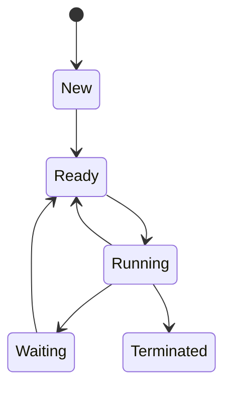

# 📘 Jawaban Soal UTS Sistem Operasi

## 1. Instalasi Ubuntu Server

📺 [Tonton Video Panduan Instalasi](https://youtu.be/q4Gn8AQwc98 "Tonton Video di YouTube")

---

## 2. Fungsi Utama Sistem Operasi

### 1. Menjalankan Program
- Memuat dan menjalankan aplikasi.
- **Contoh:** Menjalankan browser atau aplikasi pengolah kata.

### 2. Operasi Input/Output
- Mengelola interaksi dengan perangkat I/O.
- **Contoh:** Menyimpan file ke harddisk atau mencetak dokumen.

### 3. Pengelolaan File
- Membaca, menulis, dan mengorganisasi file.
- **Contoh:** Membuka, memindahkan, atau menghapus file.

### 4. Komunikasi Antar Proses
- Memfasilitasi komunikasi antar program yang sedang berjalan.
- **Contoh:** Web server dan database saling bertukar data.

### 5. Deteksi Kesalahan
- Mendeteksi kesalahan pada perangkat keras atau perangkat lunak.

### 6. Proteksi
- Mengatur hak akses pengguna ke sumber daya.
- **Contoh:** User biasa tidak bisa mengubah file sistem.

### 7. Akuntansi
- Memonitor penggunaan sumber daya.
- **Contoh:** Mencatat pemakaian CPU oleh user tertentu.

---

## 3. Diagram Status Proses

**Penjelasan Status:**
- **New:** Proses dibuat.
- **Ready:** Proses siap dijalankan oleh CPU.
- **Running:** Proses sedang dijalankan.
- **Waiting:** Proses menunggu sumber daya.
- **Terminated:** Proses selesai dieksekusi.

---

## 3. Usulan Sistem Operasi Server untuk Data Center

### Rekomendasi OS

#### Linux (RHEL, CentOS, Ubuntu Server)
- Open-source, hemat sumber daya.
- Mendukung Docker dan KVM.
- Cocok untuk aplikasi web dan database.

#### Windows Server
- GUI intuitif.
- Integrasi dengan Active Directory & SQL Server.
- Cocok untuk lingkungan enterprise.

### Aplikasi Penunjang

- **Virtualisasi/Kontainer:** VMware vSphere, Kubernetes
- **Load Balancer:** Nginx, HAProxy
- **Monitoring:** Prometheus + Grafana, Zabbix
- **Database:** MySQL, PostgreSQL, MongoDB
- **Backup:** Bacula
- **Keamanan:** SELinux, AppArmor, iptables, ufw

** Saran:**  
Gunakan Linux untuk efisiensi dan fleksibilitas. Terapkan Kubernetes untuk orkestrasi kontainer dan Prometheus untuk monitoring otomatis.

---

## 4. Perbedaan Proses dan Thread

| Aspek        | Proses                                      | Thread                                       |
|--------------|---------------------------------------------|----------------------------------------------|
| Pengertian   | Eksekusi program secara terpisah di memori  | Unit eksekusi yang berjalan di dalam proses  |
| Akses Memori | Memiliki ruang memori sendiri.              | Berbagi memori dengan thread lain.           |
| Beban Sistem | Lebih berat karena isolasi penuh.           | Ringan karena berbagi sumber daya            |
| Komunikasi   | Harus melalui mekanisme IPC                 | Lebih mudah lewat memori bersama             |
| Kegagalan    | Tidak memengaruhi proses lain               | Dapat berdampak ke keseluruhan proses        |

###  Kelebihan Proses
- Stabil dan aman karena isolasi antar proses.
  
###  Kekurangan Proses
- Membutuhkan lebih banyak sumber daya.

###  Kelebihan Thread
- Lebih ringan dan efisien untuk multitasking.

###  Kekurangan Thread
- Rawan kesalahan seperti race condition dan deadlock.

---

## 5. Komponen Utama Sistem Operasi & Jenis Kernel

### Komponen Utama

- **Kernel:** Komponen inti yang menangani manajemen perangkat keras dan proses.
- **Shell:** Antarmuka antara pengguna dan sistem, bisa berbasis teks (CLI) atau grafis (GUI).
- **System Utilities:** Peralatan bantu untuk menjalankan tugas dasar, seperti cp, ls, dan top.

### Jenis Kernel

| Jenis         | Ciri Khas                                                | Kelebihan             | Kekurangan                 | Contoh OS         |
|---------------|----------------------------------------------------------|-----------------------|----------------------------|-------------------|
| Monolitik     | Semua layanan berjalan di dalam kernel                   | Cepat dan efisien     | Risiko tinggi bila crash   | Linux             |
| Mikrokernel   | Hanya fungsi dasar di kernel, lainnya di user space      | Stabil dan modular    | Lebih lambat               | MINIX, QNX        |
| Hybrid        | Kombinasi monolitik dan mikrokernel                      | seimbang performa     | Desain lebih kompleks      | Windows NT, macOS |

---
